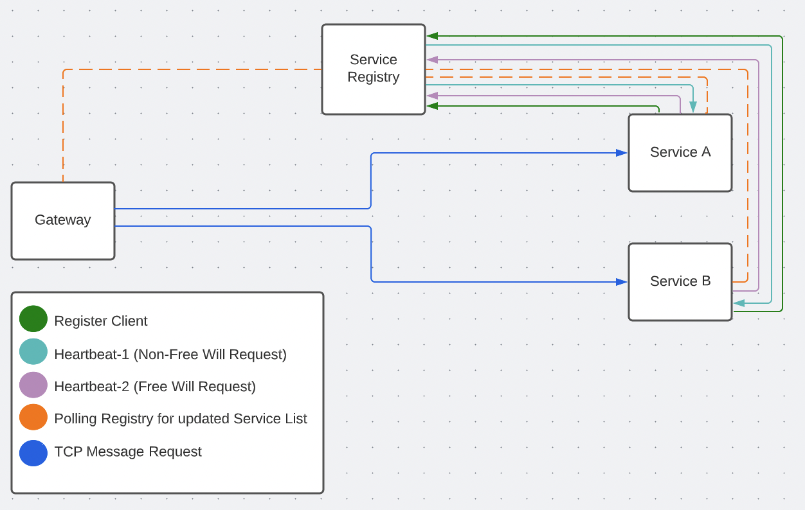

# Service Discovery

This project is a PoC of a NestJS specific service discovery mechanism.

## Features

- Service Registry (Used for registering all services on the network)
- Two-way Heartbeat Healthcheck Mechanism (Full-Duplex Enhanced Healthcheck that ensures services can communicate with each other)
- Circuit Breaker (Stop Requests executing to unhealthy services)
- Load Balancer (Distributes Traffic between multiple instances of a service on the network)

## Architecture Diagram

## Free Will Requests vs Non-Free Will Requests

In the context of this project, a Free-Will Request is a request made by the service to the registry on it's own without any prompting from the registry. This is used to check the service can send requests outbound without the need for an open connection.

A Non-Free Will Request is a request made by the registry to the service, used to check if the service can receive requests and respond to them.

These two requests are used to form the Heartbeat mechanism.

## Heartbeat Mechanism

This is the mechanism used to ensure a service marked as `HEALTHY` is actually healthy.

Heres the flow of requests for a service to be marked as `HEALTHY`:

- Service registers with the registry (Service is now marked as REGISTERING) and depending of the configuration of the `CircuitBreaker` can be sent requests.
- Registry sends the `Heartbeat-1` request to the service.
- The Service now acknowledges the registry knows it exists and has started a heartbeat.
- Service sends the `Heartbeat-2` request to the registry.
- Registry receives the `Heartbeat-2` request and acknowledges the service is healthy.

The two Heartbeat requests keep going every 5s to ensure the service is healthy.

## Service States

 - `REGISTERING`: The service is registering with the registry.
 - `HEALTHY`: The service is healthy and can receive requests.
 - `UNHEALTHY`: The service is unhealthy, can potentially receive requests, but only if there is no other instances of this service on the network.
 - `CRITICAL`: The service has missed numerous heartbeats and should not receive requests (This is step 1/2 of removing a service from the registry)
 - `DEREGISTERING`: Final step before removal, a service can only be saved from removal if a `Heartbeat-2` request is received from the registry.

## Licensing and Copyright

 - This project is licensed and can be freely distributed under the terms of the [MIT](./LICENSE) license.